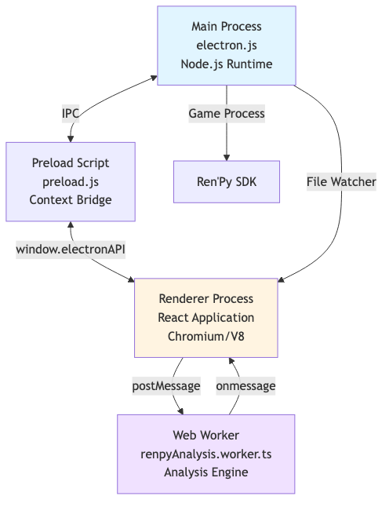
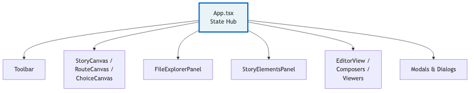
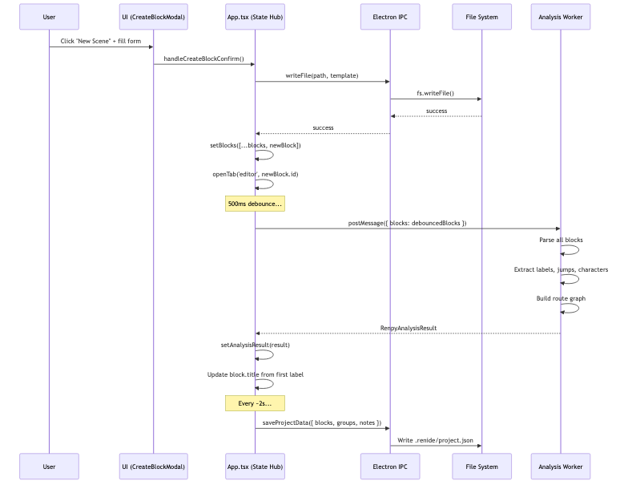
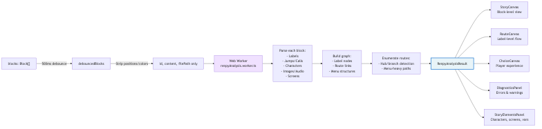

# Ren'IDE Architecture

This document provides a high-level overview of Ren'IDE's system design and architecture patterns. For deeper technical details on specific modules, see the specialized documentation linked throughout this guide.

## Table of Contents

- [System Overview](#system-overview)
- [Process Architecture](#process-architecture)
- [IPC Communication](#ipc-communication)
- [State Management](#state-management)
- [Data Flow](#data-flow)
- [Component Hierarchy](#component-hierarchy)
- [Performance Considerations](#performance-considerations)
- [Testing Philosophy](#testing-philosophy)

---

## System Overview

Ren'IDE is an Electron-based desktop application built with React and TypeScript for visual novel development using the Ren'Py framework. The application provides a visual canvas-based interface for organizing and navigating `.rpy` script files, integrated Monaco code editors, and specialized composers for scene, imagemap, and screen layout design.

**Key Technologies:**
- **Electron** (v34.2.0) - Cross-platform desktop framework
- **React** (v18.3.1) - UI component library
- **TypeScript** (v5.7.2) - Type-safe development
- **Vite** (v5.4.11) - Build tool and dev server
- **Monaco Editor** (v0.52.0) - Code editor engine (from VS Code)
- **Immer** (v10.1.1) - Immutable state updates
- **Tailwind CSS** (v3.4.17) - Utility-first styling

**Architecture Philosophy:**
- **Files-first approach**: `.rpy` files remain as plain text on disk - no proprietary formats or lock-in
- **Single source of truth**: `src/types.ts` defines all data models
- **Centralized state**: `App.tsx` manages all core application state
- **Performance-conscious**: Aggressive memoization, web workers for heavy computation, debounced updates

---

## Process Architecture

Ren'IDE follows Electron's standard multi-process architecture with three distinct runtime environments:



### Main Process (electron.js)

**Responsibilities:**
- Application lifecycle management (startup, quit, updates)
- Native OS integration (menus, dialogs, window management)
- File system operations (read, write, watch for changes)
- Child process management (Ren'Py game execution)
- Settings persistence (app-settings.json, project.json, ide-settings.json)
- Secure credential storage (API keys via Electron's `safeStorage`)
- Custom protocol registration (`media://` for streaming assets)

**Key Features:**
- **File Watcher**: Monitors project directory for external `.rpy` changes with 400ms debounce
- **Self-Write Suppression**: Ignores change events for 3 seconds after the app writes a file
- **AppImage Workarounds**: Injects `--no-sandbox` flags before Electron import for Linux AppImages
- **Update Management**: Integrates with `electron-updater` for auto-updates

### Renderer Process (React Application)

**Responsibilities:**
- User interface rendering and interaction
- Application state management (via React hooks)
- Code editing (Monaco integration)
- Canvas visualization and interaction
- Analysis result processing and display

**Entry Points:**
- `src/index.tsx` - React DOM root mount point
- `src/App.tsx` - Main application component (5,300+ lines - the state hub)

### Preload Script (preload.js)

**Responsibilities:**
- Secure IPC bridge between main and renderer processes
- Exposes `window.electronAPI` to renderer via `contextBridge`
- Type-safe API surface for cross-process communication

**Security Model:**
- Uses Electron's `contextBridge` for isolated exposure
- No direct `require()` or Node.js access in renderer
- All file system operations routed through IPC handlers

### Web Worker (renpyAnalysis.worker.ts)

**Responsibilities:**
- Heavy Ren'Py script parsing and analysis
- Label/jump/call relationship extraction
- Character and screen definition detection
- Route enumeration for Flow and Choices canvases
- Diagnostic generation (errors, warnings, info)

**Performance Benefits:**
- Runs on separate thread - doesn't block UI
- Processes all blocks in parallel
- Returns comprehensive `RenpyAnalysisResult` with labels, jumps, characters, diagnostics, and canvas layout data

---

## IPC Communication

All cross-process communication uses a `namespace:action` pattern for organization and discoverability.

### IPC Pattern

**Renderer to Main (Request/Response):**
```typescript
// Renderer
const content = await window.electronAPI.fs.readFile('/path/to/file.rpy');

// Preload
ipcRenderer.invoke('fs:readFile', filePath)

// Main
ipcMain.handle('fs:readFile', async (event, path) => {
  return fs.readFile(path, 'utf-8');
});
```

**Main to Renderer (Push Events):**
```typescript
// Main
mainWindow.webContents.send('file-changed-externally', filePath);

// Renderer
useEffect(() => {
  const unsubscribe = window.electronAPI.onFileChangedExternally((path) => {
    // Handle external file change
  });
  return unsubscribe;
}, []);
```

### IPC Namespaces

| Namespace | Purpose | Key Handlers |
|-----------|---------|-------------|
| `fs` | File system operations | `readFile`, `writeFile`, `createDirectory`, `removeEntry`, `moveFile`, `copyEntry`, `scanDirectory`, `fileExists` |
| `project` | Project-level operations | `load`, `refresh-tree`, `refresh`, `search`, `cancel-load` |
| `dialog` | Native OS dialogs | `openDirectory`, `createProject`, `createProjectFromTemplate`, `selectRenpy`, `showSaveDialog` |
| `game` | Ren'Py game execution | `run`, `stop` (+ events: `game-started`, `game-stopped`, `game-error`) |
| `renpy` | Ren'Py SDK integration | `check-path`, `generate-translations` |
| `app` | Application settings & lifecycle | `get-settings`, `save-settings`, `load-api-keys`, `save-api-key`, `get-api-key`, `getUserDataPath`, `get-startup-args` |
| `path` | Path utilities | `join` |
| `shell` | OS shell integration | `openExternal`, `showItemInFolder` |
| `explorer` | File explorer integration | (context menu actions) |

### Push Events (Main → Renderer)

| Event | Purpose | Payload |
|-------|---------|---------|
| `project:load-progress` | Project loading progress | `(progress: number, message: string)` |
| `file-changed-externally` | External file modification | `(filePath: string)` |
| `game-started` | Ren'Py process launched | none |
| `game-stopped` | Ren'Py process exited | none |
| `game-error` | Ren'Py launch error | `(error: string)` |
| `menu-command` | Application menu action | `(command: string)` |
| `check-unsaved-changes-before-exit` | Request unsaved changes check | none |
| `show-exit-modal` | Request exit confirmation modal | none |
| `save-ide-state-before-quit` | Request state persistence before quit | none |
| `update-available` | Auto-updater found new version | `(version: string)` |

---

## State Management

Ren'IDE uses a **centralized state architecture** where all core application state lives in `App.tsx`. This design simplifies data flow and eliminates the complexity of deeply nested context providers or external state management libraries.

### State Hub Pattern

`App.tsx` is the single source of truth for application state. All state is managed through React hooks (`useState`, `useImmer`, custom hooks) and flows downward via props.



### State Categories

#### 1. Core Project State (Undo/Redo via `useHistory`)

```typescript
const { state: blocks, setState: setBlocks, undo, redo, canUndo, canRedo }
  = useHistory<Block[]>([]);
```

**Characteristics:**
- Full undo/redo history for block creation, deletion, and position changes
- Only `blocks[]` participates in undo/redo — editor text changes managed by Monaco
- Persists to `.renide/project.json` (positions) and individual `.rpy` files (content)

#### 2. Project Metadata (via `useImmer`)

```typescript
const [groups, setGroups] = useImmer<BlockGroup[]>([]);
const [stickyNotes, setStickyNotes] = useImmer<StickyNote[]>([]);
const [diagnosticsTasks, setDiagnosticsTasks] = useImmer<DiagnosticsTask[]>([]);
const [characterProfiles, setCharacterProfiles] = useImmer<Character[]>([]);
```

**Characteristics:**
- Immutable updates via Immer drafts
- Persists to `.renide/project.json`

#### 3. Asset State (via `useState` with Maps)

```typescript
const [images, setImages] = useState<Map<string, ProjectImage>>(new Map());
const [audios, setAudios] = useState<Map<string, RenpyAudio>>(new Map());
```

**Characteristics:**
- Maps provide O(1) lookup by file path
- Metadata persists to `.renide/ide-settings.json`
- Actual files remain on disk — no duplication

#### 4. Composition State (via `useImmer`)

```typescript
const [sceneCompositions, setSceneCompositions] = useImmer<Map<string, SceneComposition>>(new Map());
const [imagemapCompositions, setImagemapCompositions] = useImmer<Map<string, ImageMapComposition>>(new Map());
const [screenLayoutCompositions, setScreenLayoutCompositions] = useImmer<Map<string, ScreenLayoutComposition>>(new Map());
```

**Characteristics:**
- One composition per saved name (like a "project" within the IDE)
- Persists to `.renide/ide-settings.json`
- Sprite data serialized without circular references

#### 5. Derived State (Computed)

```typescript
const debouncedBlocks = useDebounce(blocks, 500);
const analysisResult = useRenpyAnalysis(debouncedBlocks, /* ... */);
const diagnosticsResult = useDiagnostics(analysisResult, /* ... */);
```

**Characteristics:**
- Recalculated when dependencies change
- Never persisted — always derived from source state
- Debounced to avoid excessive re-computation during rapid changes (e.g., dragging blocks)

#### 6. Session-Only State (via `useState`)

```typescript
const [openTabs, setOpenTabs] = useState<EditorTab[]>([]);
const [activeTabId, setActiveTabId] = useState<string | null>(null);
const [selectedBlockIds, setSelectedBlockIds] = useState<Set<string>>(new Set());
```

**Characteristics:**
- UI state that doesn't need to persist across sessions
- Resets on app restart

#### 7. Application Settings (via custom hook)

```typescript
const { settings, updateSettings } = useSettingsManagement();
```

**Characteristics:**
- Theme, font, layout preferences, SDK path, mouse behavior
- Persists to `userData/app-settings.json` (platform-specific user data directory)
- API keys stored separately via Electron's `safeStorage` (encrypted OS keychain)

### Persistence Strategy

| Data | Storage Location | Format | When Written |
|------|-----------------|--------|--------------|
| Block positions/groups | `.renide/project.json` | JSON | Every ~2 seconds (debounced) |
| Block content | Individual `.rpy` files | Plain text | On save (`Ctrl+S`) |
| Compositions | `.renide/ide-settings.json` | JSON | Immediately after changes |
| Asset metadata | `.renide/ide-settings.json` | JSON | Immediately after scan |
| App settings | `userData/app-settings.json` | JSON | Immediately after changes |
| API keys | OS keychain | Encrypted binary | Immediately after save |
| Diagnostics tasks | `.renide/project.json` | JSON | Immediately after changes |
| Character profiles | `.renide/project.json` | JSON | Immediately after changes |
| Ignored diagnostics | `.renide/project.json` | JSON | Immediately after suppression |

**Note**: The `.renide/` folder is project-specific IDE metadata. Deleting it won't affect `.rpy` files.

---

## Data Flow

### Block Lifecycle (Creation → Editing → Persistence → Analysis)



**Key Points:**
1. **File is created on disk first** via IPC — ensures `.rpy` files exist before state updates
2. **Block added to state immediately** — UI is responsive, doesn't wait for analysis
3. **Debounced analysis** (500ms) — dragging blocks doesn't trigger re-analysis, only content changes do
4. **Analysis only receives `{ id, content, filePath }`** — position/width/color excluded to prevent false change detection
5. **Title derived from analysis** — first label name becomes block title, deterministic color from hash
6. **Persistence is separate** — block positions saved every ~2 seconds, content only on explicit save

### File System Operations Flow

File system operations follow a strict request/response pattern through IPC to maintain security and consistency:

1. **User action** → FileExplorerPanel receives interaction (e.g., right-click → Rename)
2. **App coordination** → App.tsx controls the modal and collects user input
3. **IPC request** → Renderer calls `window.electronAPI.fs.moveFile(oldPath, newPath)`
4. **Main process handles** → `fs:moveFile` handler executes `fs.rename()`
5. **File watcher suppression** → Main process suppresses change events for 3 seconds
6. **State sync** → App.tsx updates `blocks[]` and `openTabs[]` with new paths
7. **Tree refresh** → App.tsx calls `refreshProjectTree()` to get updated structure
8. **UI update** → FileExplorerPanel re-renders with new tree

**Key Points:**
1. **All file operations route through IPC** — renderer never touches `fs` directly
2. **Main process suppresses self-writes** — prevents false "external change" notifications
3. **State updated after file operation succeeds** — ensures consistency with disk
4. **Tree refresh is explicit** — only when structural changes occur

### Analysis Pipeline (Content → Worker → Result → UI)



**Key Data Structures:**

```typescript
interface RenpyAnalysisResult {
  // Label definitions and relationships
  labels: Record<string, { blockId: string; lineNumber: number; isStart: boolean }>;
  jumps: Record<string, string[]>;  // blockId -> target labels
  calls: Record<string, string[]>;  // blockId -> target labels

  // Canvas-specific data
  labelNodes: LabelNode[];          // For RouteCanvas & ChoiceCanvas
  routeLinks: RouteLink[];          // For RouteCanvas & ChoiceCanvas
  identifiedRoutes: Route[];        // Pre-computed route paths

  // Story elements
  characters: Record<string, Character>;
  screens: Record<string, { blockId: string; lineNumber: number }>;
  variables: Record<string, Variable>;
  images: string[];                 // Referenced image tags
  audios: string[];                 // Referenced audio tags

  // Diagnostics
  errors: Diagnostic[];
  warnings: Diagnostic[];
  info: Diagnostic[];
}
```

---

## Component Hierarchy

Ren'IDE follows a **hybrid component architecture**:
- Large, stateful "feature components" for major UI sections
- Small, reusable "primitive components" for buttons, modals, inputs
- Canvas components use `React.memo` + `forwardRef` for performance

### Top-Level Structure

```
App.tsx (State Hub)
├── Toolbar
│   ├── Canvas switcher (Story / Route / Choice)
│   ├── Action buttons (Undo, Redo, New Scene, etc.)
│   └── Game controls (Run, Stop, Warp to Label)
├── Main Content Area
│   ├── FileExplorerPanel (left sidebar)
│   ├── Canvas Area (center)
│   │   ├── StoryCanvas (block-level view)
│   │   ├── RouteCanvas (label-level flow)
│   │   └── ChoiceCanvas (player experience)
│   ├── EditorView (center, when tab active)
│   │   ├── MonacoEditor (code editor)
│   │   ├── DialoguePreview (inline player view)
│   │   └── Split pane support
│   └── StoryElementsPanel (right sidebar)
│       ├── Story Data tabs (Characters, Variables, Screens)
│       ├── Assets tabs (Images, Audio)
│       ├── Composers tabs (Scenes, ImageMaps, Screen Layouts)
│       └── Tools tabs (Snippets, Menus, Colors)
├── Modals & Overlays (React portals)
│   ├── SettingsModal
│   ├── CreateBlockModal
│   ├── WarpVariablesModal
│   ├── GoToLabelModal
│   ├── SearchPanel
│   └── Toast notifications
└── StatusBar (bottom)
    ├── Current file path
    ├── Cursor position (Ln/Col)
    ├── Diagnostics summary
    └── App version
```

### Canvas Component Design

All three canvases share a common architecture:

```typescript
// Canvas-level component (StoryCanvas, RouteCanvas, ChoiceCanvas)
const Canvas: React.FC<Props> = ({ blocks, analysisResult, ... }) => {
  // Canvas transform state (pan, zoom)
  const [transform, setTransform] = useState({ x: 0, y: 0, scale: 1 });

  // Selection state
  const [selectedIds, setSelectedIds] = useState<Set<string>>(new Set());

  // Drag state machine
  const [dragState, setDragState] = useState<DragState | null>(null);

  // Global pointer event listeners for drag performance
  useEffect(() => {
    if (dragState) {
      const onMove = (e: PointerEvent) => { /* apply delta */ };
      const onUp = () => { setDragState(null); };
      window.addEventListener('pointermove', onMove);
      window.addEventListener('pointerup', onUp);
      return () => {
        window.removeEventListener('pointermove', onMove);
        window.removeEventListener('pointerup', onUp);
      };
    }
  }, [dragState]);

  return (
    <div className="canvas-container">
      {blocks.map(block => (
        <CanvasBlock
          key={block.id}
          block={block}
          onPointerDown={handleDragStart}
          onClick={handleSelect}
          // ...
        />
      ))}
    </div>
  );
};

// Block-level component (CodeBlock, LabelBlock, etc.)
const CanvasBlock = React.memo(React.forwardRef<HTMLDivElement, Props>((props, ref) => {
  return (
    <div ref={ref} className="block">
      <div className="drag-handle" onPointerDown={props.onPointerDown}>
        {/* Draggable header */}
      </div>
      <div className="block-content">
        {/* Non-draggable content (buttons, text) */}
      </div>
    </div>
  );
}));
```

**Performance Optimizations:**
- **Native pointer events**: `pointerdown`/`pointermove`/`pointerup` instead of React synthetic events during drag
- **Global listeners**: Attached on drag start, removed on release — avoids React re-renders
- **Memoization**: `React.memo` prevents re-render when props unchanged
- **Drag handle pattern**: Elements with `.drag-handle` class initiate drag; buttons/inputs do not propagate
- **Transform via CSS**: `translate()` and `scale()` for 60fps canvas panning/zooming

### Tab System

The tab system supports lazy mounting and preserves state:

```typescript
interface EditorTab {
  id: string;
  type: 'canvas' | 'editor' | 'image' | 'audio' | 'scene-composer' | /* ... */;
  title: string;
  blockId?: string;      // For editor tabs
  filePath?: string;     // For editor tabs
  hasUnsavedChanges?: boolean;
  hasMounted?: boolean;  // Lazy mount flag
}

// In App.tsx
const renderTabContent = (tab: EditorTab) => {
  if (tab.id !== activeTabId && !tab.hasMounted) {
    return null;  // Don't mount yet
  }

  const isActive = tab.id === activeTabId;

  switch (tab.type) {
    case 'editor':
      return <EditorView style={{ display: isActive ? 'block' : 'none' }} />;
    case 'scene-composer':
      return <SceneComposer style={{ display: isActive ? 'block' : 'none' }} />;
    // ...
  }
};
```

**Characteristics:**
- **Lazy mount**: Tabs don't render until first activation
- **Hidden, not unmounted**: After first mount, tabs stay mounted but hidden (`display: none`)
- **State preservation**: Monaco scroll position, composer undo history, etc. persist across tab switches
- **Memory trade-off**: More memory for better UX (instant tab switching)

---

## Performance Considerations

### 1. Analysis Debouncing

**Problem**: Dragging blocks triggers position changes → `blocks` state updates → re-analysis → wasted CPU
**Solution**: Only pass `{ id, content, filePath }` to analysis — position/width/color excluded

```typescript
const blocksForAnalysis = useMemo(
  () => blocks.map(b => ({ id: b.id, content: b.content, filePath: b.filePath })),
  [blocks]
);
const debouncedBlocks = useDebounce(blocksForAnalysis, 500);
const analysisResult = useRenpyAnalysis(debouncedBlocks);
```

### 2. Memoization Discipline

**Problem**: `blocks` changes → derived arrays/sets recalculated → canvas re-renders → 1000+ blocks = janky
**Solution**: Aggressively memoize derived data

```typescript
// Bad: creates new array on every render
const blockIds = blocks.map(b => b.id);

// Good: only recreates when blocks identity changes
const blockIds = useMemo(() => blocks.map(b => b.id), [blocks]);

// Also memoize Sets and Maps
const menuLabels = useMemo(
  () => new Set(Object.keys(analysisResult.labels)),
  [analysisResult.labels]
);
```

### 3. Web Worker for Heavy Computation

**Problem**: Parsing thousands of lines of Ren'Py code blocks the main thread
**Solution**: `renpyAnalysis.worker.ts` runs on separate thread

**Trade-offs:**
- **Pro**: UI stays responsive during analysis
- **Pro**: Parallelizable across multiple blocks
- **Con**: Can't access DOM or React state
- **Con**: Data must be serializable (no functions, no circular refs)

### 4. Virtual Scrolling (File Explorer)

**Problem**: Rendering 1000+ tree nodes at once = slow initial render
**Solution**: `useVirtualList` hook renders only visible nodes + buffer

```typescript
const { visibleItems, containerRef } = useVirtualList({
  items: flattenedTree,
  itemHeight: 24,
  containerHeight: explorerHeight,
  overscan: 5,  // Render 5 extra items above/below viewport
});
```

### 5. Canvas Rendering (Native Events + CSS Transforms)

**Problem**: React synthetic events + reconciliation = 30fps canvas dragging
**Solution**: Native pointer events + direct CSS `transform` manipulation

```typescript
// Drag initiated via native pointerdown
const handlePointerDown = (e: React.PointerEvent) => {
  const onMove = (e: PointerEvent) => {
    // Direct DOM manipulation - bypass React
    element.style.transform = `translate(${x}px, ${y}px)`;
  };
  window.addEventListener('pointermove', onMove);  // Native listener
};
```

### 6. TextMate + Semantic Tokens (Syntax Highlighting)

**Problem**: Monaco's built-in Ren'Py support doesn't exist
**Solution**: Two-layer highlighting approach

1. **TextMate grammar** (`renpy.tmLanguage.json`) - syntax structure
2. **Semantic tokens** - live data from `RenpyAnalysisResult` (known vs unknown labels, characters, etc.)

**Performance:**
- TextMate runs once per edit (Oniguruma WASM)
- Semantic tokens recalculate when analysis result changes
- Both layers cache tokenization until content changes

### 7. Persistence Debouncing

**Problem**: Saving `.renide/project.json` after every block drag = disk thrashing
**Solution**: 2-second debounce on position persistence

```typescript
useEffect(() => {
  const timer = setTimeout(() => {
    saveProjectData({ blocks, groups, notes });
  }, 2000);
  return () => clearTimeout(timer);
}, [blocks, groups, notes]);
```

**Trade-off**: Up to 2 seconds of work lost if app crashes (acceptable for position data)

### 8. Performance Metrics (Observability)

**Built-in instrumentation** for profiling in production:

```typescript
const metrics = usePerformanceMetrics();
// metrics.projectLoadTime
// metrics.analysisWorkerDuration
// metrics.assetScanTime
// metrics.canvasFps
// metrics.jsHeapSize
```

Displayed in the **Stats** tab → **IDE Performance** section.

---

## Testing Philosophy

Ren'IDE follows a **pragmatic testing approach** focused on critical paths and regression prevention.

### Testing Layers

```
┌─────────────────────────────────────────┐
│  End-to-End (Playwright - Future)      │  Full user workflows
├─────────────────────────────────────────┤
│  Integration (Vitest + JSDOM)          │  Multi-component interactions
├─────────────────────────────────────────┤
│  Unit (Vitest)                          │  Pure functions, hooks, utilities
├─────────────────────────────────────────┤
│  Type Safety (TypeScript)               │  Compile-time guarantees
└─────────────────────────────────────────┘
```

### Current Test Coverage

**Unit Tests:**
- `lib/` modules (pure functions) - 70%+ coverage
  - `storyCanvasLayout.ts` - layout algorithms
  - `routeCanvasLayout.ts` - label node positioning
  - `graphLayout.ts` - DAG layout + route enumeration
  - `renpyValidator.ts` - syntax validation
  - `colorUtils.js` - color conversion
- Hooks - 50%+ coverage
  - `useHistory.test.ts` - undo/redo stack
  - `useDebounce.test.ts` - timing behavior

**Integration Tests:**
- Mock Electron API (`src/test/mocks/electronAPI.ts`)
- Sample data factories (`src/test/mocks/sampleData.ts`)
- Component rendering + interaction
- File system operation flows

**What's NOT Tested:**
- Main process (electron.js) - would require Spectron/Playwright
- Complex canvas drag interactions - JSDOM doesn't support full pointer events
- Monaco editor integration - too heavyweight for unit tests

### Testing Tools

| Tool | Purpose | Config File |
|------|---------|------------|
| **Vitest** | Test runner (Vite-native) | `vitest.config.ts` |
| **JSDOM** | DOM emulation in Node.js | `src/test/setup.ts` |
| **@testing-library/react** | Component testing utilities | Imported per test |
| **Mock Electron API** | IPC stubbing | `src/test/mocks/electronAPI.ts` |

### Running Tests

```bash
npm test                                    # Run all tests once
npm run test:watch                          # Watch mode
npx vitest run src/hooks/useHistory.test.ts # Single file
npm run test:coverage                       # Coverage report (v8)
```

### Test Philosophy Principles

1. **Test behavior, not implementation** - Focus on inputs/outputs, not internal state
2. **Mock the boundaries** - Stub IPC, file system, heavy computations — test logic, not I/O
3. **Snapshot tests sparingly** - Only for stable, reviewable output (e.g., generated Ren'Py code)
4. **Integration over unit** - One test exercising multiple units > 10 isolated unit tests
5. **Performance tests for regressions** - Canvas FPS, analysis worker duration, memory usage

### Coverage Expectations

| Layer | Target Coverage | Rationale |
|-------|----------------|-----------|
| `lib/` (pure functions) | 80%+ | High ROI - easy to test, catches regressions |
| Hooks | 60%+ | Medium ROI - logic-heavy, but need mocking |
| Components | 40%+ | Low ROI - high churn, behavior > coverage |
| `electron.js` (main process) | 0% (for now) | Requires E2E setup (Playwright) |

---

## Related Documentation

For deeper technical details on specific modules:

- **File System Operations**: (Coming soon) `docs/FILE_SYSTEM.md`
- **Monaco Integration**: (Coming soon) `docs/MONACO_EDITOR.md`
- **Canvas Architecture**: (Coming soon) `docs/CANVAS_RENDERING.md`
- **Analysis Engine**: (Coming soon) `docs/ANALYSIS_PIPELINE.md`
- **Testing Guide**: (Coming soon) `docs/TESTING.md`
- **Contributing Guide**: `CONTRIBUTING.md` (if exists)

For project-specific instructions when working with Claude Code, see `CLAUDE.md`.

---

## Appendix: Key File Reference

| File | Lines | Purpose |
|------|-------|---------|
| `src/App.tsx` | 5,320 | State hub - all core state and coordination logic |
| `src/types.ts` | 1,500+ | Single source of truth for all TypeScript interfaces |
| `electron.js` | 2,000+ | Main process - file system, IPC handlers, game execution |
| `preload.js` | 300 | IPC bridge - secure context bridge to renderer |
| `src/workers/renpyAnalysis.worker.ts` | 1,200+ | Analysis engine - parsing, graph building, diagnostics |
| `src/lib/storyCanvasLayout.ts` | 800+ | Auto-layout algorithms for StoryCanvas |
| `src/lib/routeCanvasLayout.ts` | 600+ | Label node positioning for RouteCanvas |
| `src/components/StoryCanvas.tsx` | 1,200+ | Block-level canvas (Project Canvas) |
| `src/components/RouteCanvas.tsx` | 1,000+ | Label-level canvas (Flow Canvas) |
| `src/components/ChoiceCanvas.tsx` | 1,000+ | Player experience canvas (Choices Canvas) |
| `src/components/EditorView.tsx` | 800+ | Monaco editor integration + dialogue preview |

---

**Last Updated**: 2026-04-28
**Ren'IDE Version**: 0.8.0 Public Beta 4
